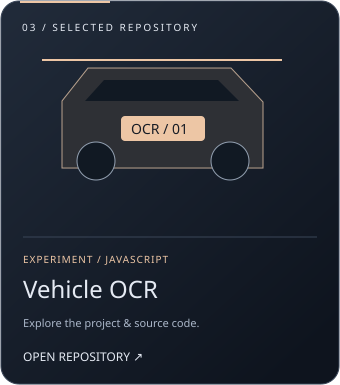

  

 

  <h1>Hey, I'm POZAN.</h1>
  
Software Engineer &amp; UI/UX Enthusiast

  <samp>A little art. A lot of curiosity. Built with code.</samp>

  

## About me

I'm **POZAN**, a Software Engineering student building digital products that are useful, tactile, and quietly memorable. I care about the whole journey: from a clear visual system in Figma to a resilient, responsive interface in the browser.

My focus sits at the intersection of **frontend engineering**, **UI/UX**, and **product thinking**. I work with Figma and Framer to find the right experience before turning it into clean, maintainable code.

## Tools of my craft

  

My strongest lane is frontend product engineering: translating a visual idea into a fast, accessible, maintainable experience.

## Selected work

  
  
  

Illustrated project covers · click a card to explore its source.

## Behind the commits

  

Metrics are generated from the GitHub API and refreshed automatically each day.

## Find me

- Email — [your.email@example.com](mailto:your.email@example.com)
- LinkedIn — [linkedin.com/in/YOUR_USERNAME](https://www.linkedin.com/in/YOUR_USERNAME)
- Portfolio — [your-domain.com](https://your-domain.com)
- Facebook — [facebook.com/FENOSM](https://www.facebook.com/FENOSM/)

  
  Somewhere between a sketch and a commit.

