<div align="center">
  <picture>
    <source media="(prefers-color-scheme: light)" srcset="./assets/header.svg">
    
  </picture>
</div>

<div align="center">
  <h1>Hi, I'm YOUR NAME <span aria-hidden="true">👋</span></h1>
  <p><strong>Software Engineer · Frontend Developer · UI/UX Enthusiast</strong></p>
  <p>I turn thoughtful interfaces into useful, polished digital products.</p>
</div>

---

## About me

I'm a Software Engineering student and developer focused on the space where engineering meets design. I enjoy transforming ideas into responsive web experiences that feel clear, fast, and intentional.

- Building modern web products with **React, Next.js, and TypeScript**
- Exploring **frontend architecture, UI/UX, and accessible design systems**
- Designing and prototyping with **Figma and Framer**
- Always refining the small details that make a product delightful to use

## Selected toolkit

```text
WEB          HTML · CSS · JavaScript · TypeScript
FRONTEND     React · Next.js
BACKEND      Node.js · Firebase · SQL
DESIGN       Figma · Framer
WORKFLOW     Git · GitHub
```

## Featured projects

<!-- Replace the sample links and descriptions below with your real projects. -->

| Project | What it does | Built with |
| :--- | :--- | :--- |
| **[Project One](https://github.com/YOUR_USERNAME/PROJECT_ONE)** | A concise sentence about the problem this project solves. | `Next.js` `TypeScript` |
| **[Project Two](https://github.com/YOUR_USERNAME/PROJECT_TWO)** | Highlight the user experience or technical challenge. | `React` `Firebase` |
| **[Project Three](https://github.com/YOUR_USERNAME/PROJECT_THREE)** | Share the outcome, impact, or one memorable detail. | `Node.js` `SQL` |

## GitHub signal

<div align="center">
  
</div>

<sub>Updated automatically every day by GitHub Actions. Commit count covers public commits discoverable by the GitHub API; contributions show the latest 12 months.</sub>

## Let's connect

I'm open to collaborating on useful products, thoughtful interfaces, and interesting web ideas.

- Email: [your.email@example.com](mailto:your.email@example.com)
- LinkedIn: [linkedin.com/in/YOUR_USERNAME](https://www.linkedin.com/in/YOUR_USERNAME)
- Portfolio: [your-domain.com](https://your-domain.com)
- Social: [facebook.com/YOUR_USERNAME](https://www.facebook.com/YOUR_USERNAME)

<div align="center">
  
  <sub>Designed with care. Built with curiosity.</sub>
</div>
